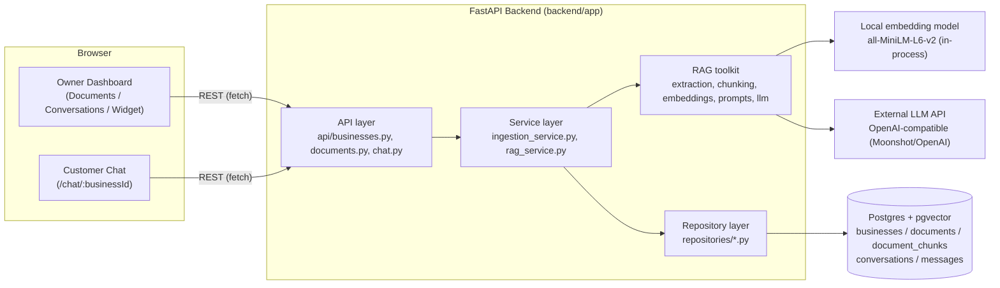
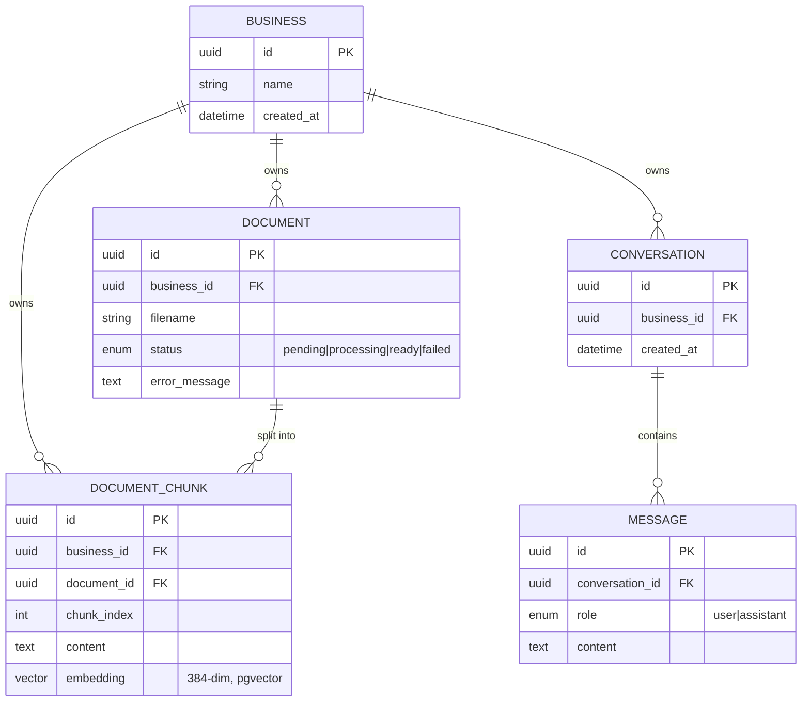
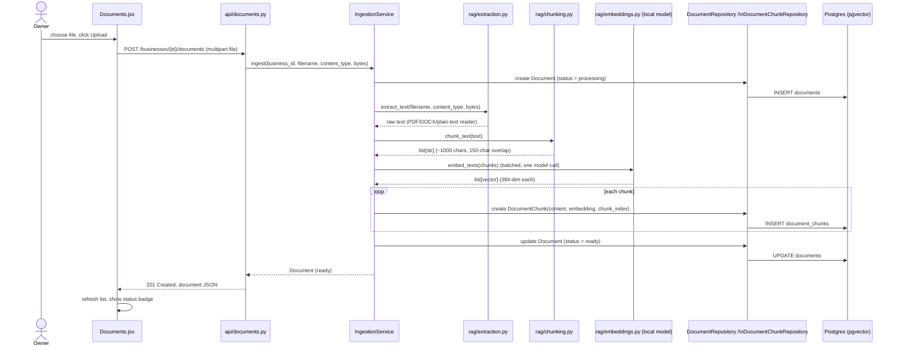
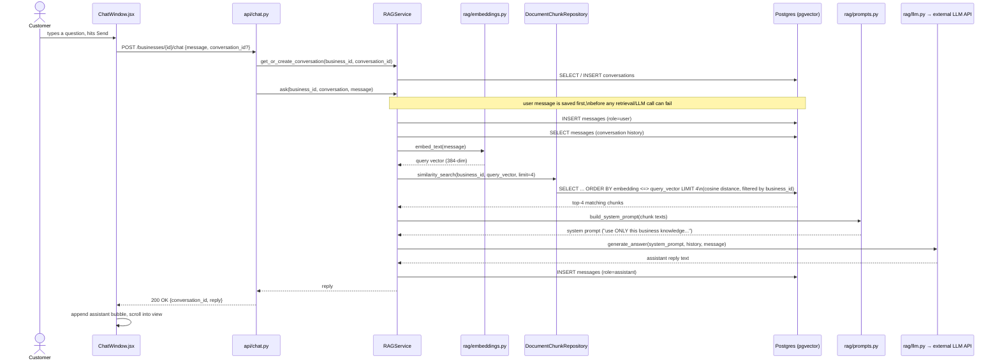
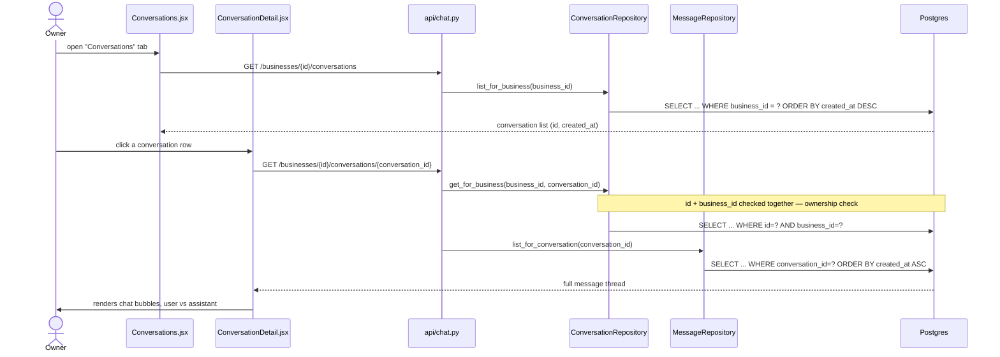
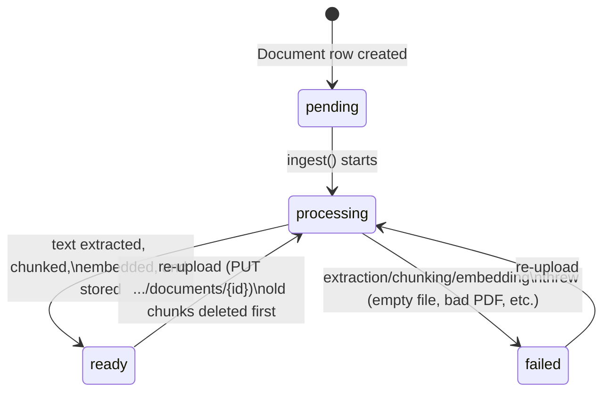
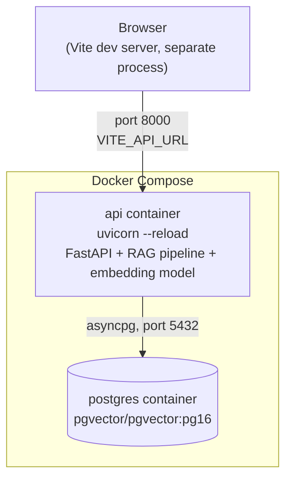

# System Architecture — SME AI CRM (RAG Chatbot)

This document describes the system design: how a document goes from "uploaded
file" to "searchable knowledge," how a customer's question becomes an answer,
and how the business owner sees a log of every conversation on their
dashboard. Diagrams are Mermaid — they render directly on GitHub/GitLab or any
Markdown viewer that supports Mermaid.

For a file-by-file breakdown of the code, see `CODEBASE_GUIDE.md`.

---

## 1. High-level architecture

Three moving pieces: a React frontend (two faces — owner dashboard and public
customer chat), a FastAPI backend, and Postgres with `pgvector` as the only
datastore. The backend also talks to two ML components: a local embedding
model (runs in-process, no external call) and a remote LLM (OpenAI-compatible
API — currently Moonshot/Kimi).

**Key design fact:** there is no authentication. A `business_id` (UUID) is the
only access control — every table row carries it, and every repository query
filters by it. The frontend stores it in `localStorage` and treats it like a
password. This is intentional for now (see `RAG_PIPELINE.md`), but must change
before this is exposed publicly beyond trusted users.

---

## 2. Data model (entity relationships)

`business_id` is denormalized onto `document_chunks` (not just reached via
`document_id`) specifically so the similarity search query can filter by
business in a single index lookup, without a join.

---

## 3. Flow: uploading a document → making it searchable

Triggered from the **Documents** dashboard page. Runs synchronously — the
HTTP request doesn't return until the file is fully chunked, embedded, and
stored (fine for small-business-sized files; see note in
`ingestion_service.py` about moving this to a background job if files get
large).

**Failure path:** if extraction/chunking/embedding throws (empty file,
unreadable PDF, etc.), `IngestionService._process` catches it, sets
`status = failed`, and writes a short `error_message` — the document is never
left stuck on `processing`. The Documents page shows this via `StatusBadge`
and the error text.

**Re-upload:** `PUT /businesses/{id}/documents/{document_id}` runs the same
pipeline but first deletes the document's existing chunks
(`delete_for_document`), so a corrected file doesn't leave stale chunks
alongside the new ones.

---

## 4. Flow: customer asks a question → chatbot answers (RAG)

Triggered from `ChatWindow.jsx`, used both on the public `/chat/:businessId`
page and as the dashboard's "preview" on the Widget page.

**Why the retrieval search runs on every message:** rather than have the LLM
decide "do I need to search," the system always searches (top 4 chunks by
cosine distance), every turn. Simpler code path, and a similarity search over
a few thousand rows is fast enough that skipping it isn't worth the added
complexity — see `rag_service.py` / `prompts.py` comments.

**Why the model doesn't hallucinate business facts:** the system prompt
(`BASE_INSTRUCTIONS` in `rag/prompts.py`) explicitly restricts the model to
the retrieved chunks for anything business-specific, and tells it to say "I
don't have that information" rather than invent a price, policy, or phone
number. General chit-chat (greetings) is allowed to be answered normally.

---

## 5. Flow: business owner reviews conversation logs

This is pure read-path — no LLM or embedding calls involved, just querying
what was already saved during flow #4.

The `get_for_business` check (id **and** business_id in the same `WHERE`) is
what stops one business from reading another's conversation just by guessing
a conversation UUID — there's no separate auth layer doing this, it's baked
into every repository query.

---

## 6. Document lifecycle (state machine)

In practice `pending` is nearly instantaneous — `IngestionService.ingest()`
creates the row already flagged `processing` and immediately calls
`_process`, since the whole pipeline runs inline within the HTTP request.

---

## 7. Deployment topology (current: docker-compose)

Only two services run today (`api`, `postgres`) — the `docker-compose.yml`
in the repo root defines exactly these. The frontend runs separately (Vite
dev server / static build) and talks to the API over `VITE_API_URL`. Alembic
migrations run automatically on container start (`alembic upgrade head`)
before uvicorn boots.

> Note: earlier container names like `worker-notifications`,
> `worker-analytics`, `worker-voice`, `worker-crm`, `worker-ingestion`, and
> `redis` seen in `docker compose up` output are **orphans** from a prior,
> more complex compose file — they are not part of the current architecture.
> Run `docker compose up --remove-orphans` to clean them up.

---

## 8. External dependencies and where they plug in

| Dependency | Used by | Purpose |
|---|---|---|
| Postgres + `pgvector` extension | `core/database.py`, all repositories | Single datastore for relational rows *and* vector similarity search (`cosine_distance`) |
| `sentence-transformers` (`all-MiniLM-L6-v2`) | `rag/embeddings.py` | Turns text into 384-dim vectors, runs locally in the API container — no external API call, no per-request cost |
| OpenAI-compatible LLM API (`llm_api_base` / `llm_api_key` / `llm_model` in `.env`) | `rag/llm.py` | Generates the actual chat reply; works with OpenAI, Moonshot/Kimi, or anything that mirrors the OpenAI chat-completions schema |
| Alembic | `backend/alembic/` | Schema migrations, applied automatically on container start |

Swapping the LLM provider is a config-only change (`llm_api_base`,
`llm_api_key`, `llm_model` in `.env`) — no code change, as long as the
provider speaks the OpenAI chat-completions format. (Caveat: some providers,
like Moonshot's Kimi models, reject non-default `temperature` values — see
`rag/llm.py`.)
